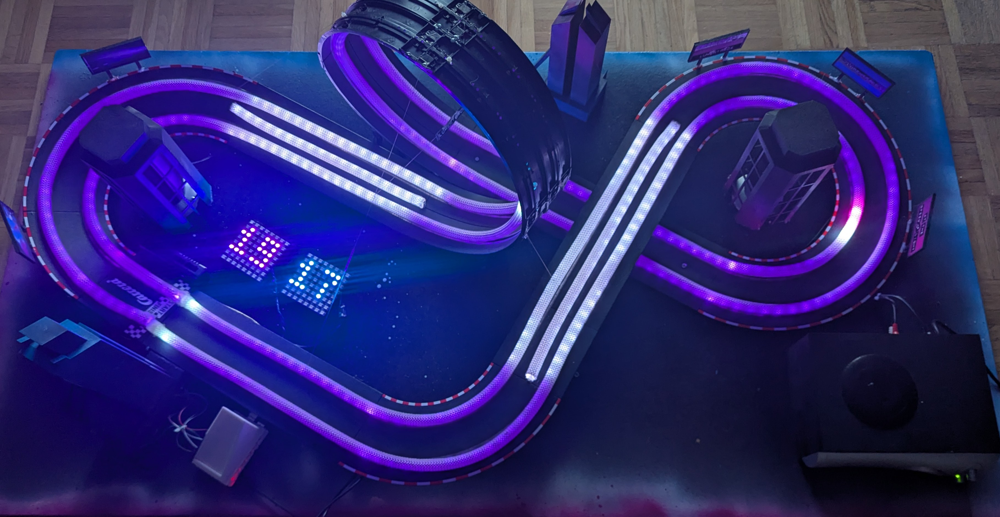
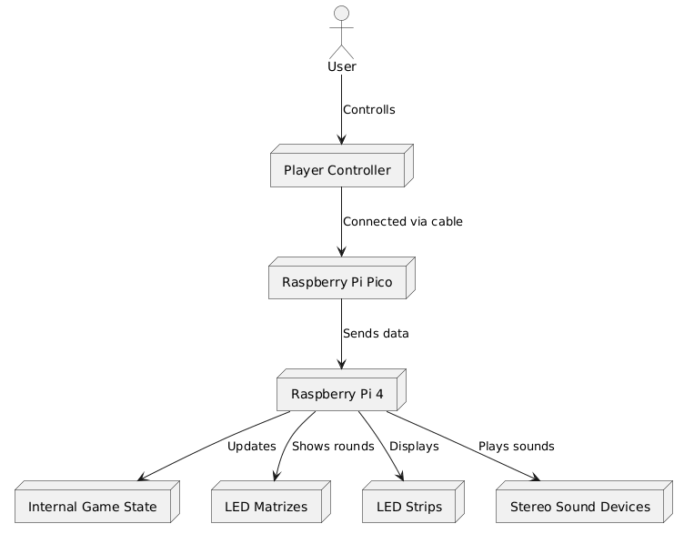
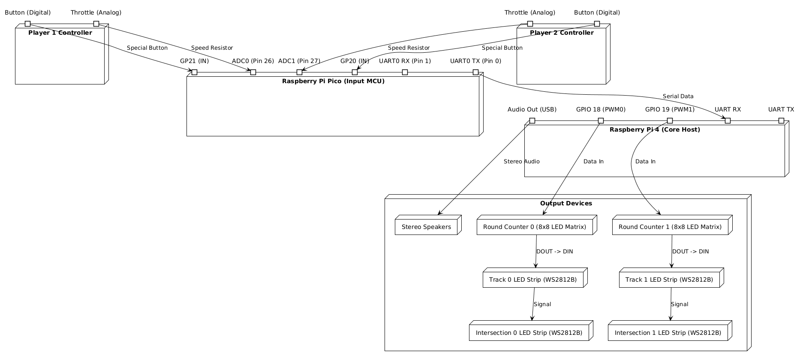
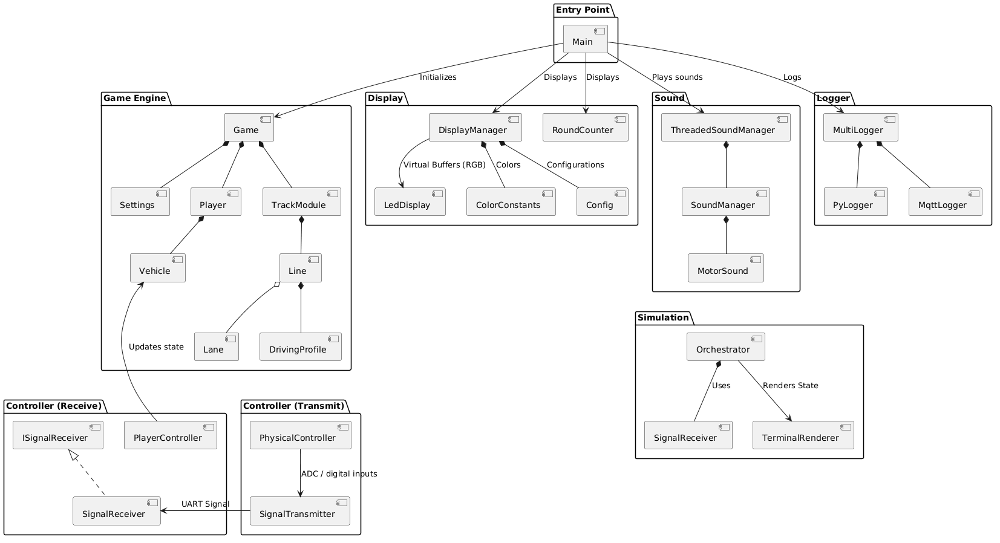
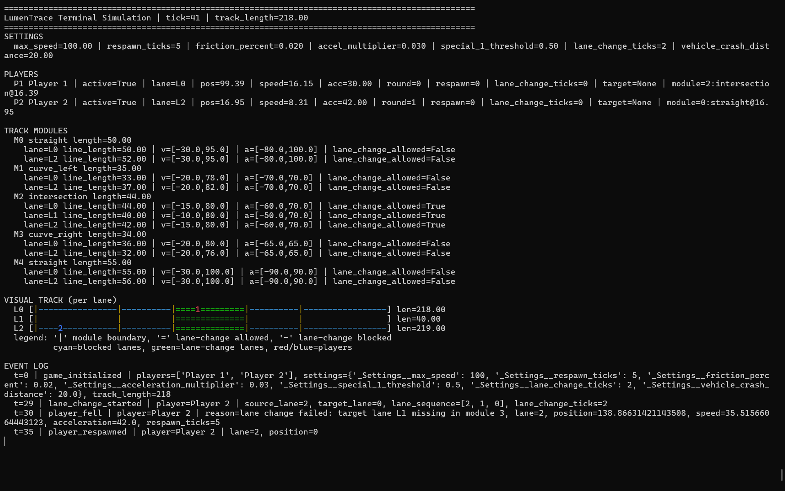
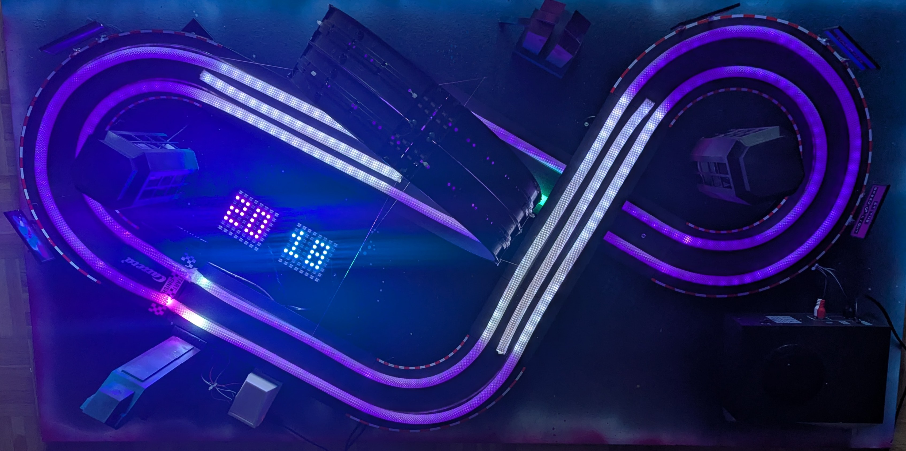

# LumenTrace

A high-performance MCU-based LED racing simulator. Bringing the classic slot car experience to the world of addressable LEDs with real-time physics and advanced light effects.

  

## Used Technologies

- Microcontrollers: Raspberry Pi Pico (Input Controller) and Raspberry Pi 4 (Core Host) with a micro-SD card for data storage.
- Programming Languages: MicroPython for the microcontroller firmware, Python for OOP design, data processing, led display, sound, testing, simulation and visualization.
- Communication Protocols: High-Speed serial communication between Pico and Pi 4 with UART, LED control via WS2812.
- Data Storage: Micro-SD card for storing and running the program on the Pi.

  

## License

This project source code is licensed under the [MIT License](LICENSE). The documentation and assets are licensed under the [Creative Commons Attribution 4.0 International License](docs/LICENSE).

## Maintainers

The contributors and maintainers of this project are:

- Simon Völkl (<s.voelkl2@oth-aw.de>)
- Erik Dombrowsky (<e.dombrowsky@oth-aw.de>)
- Simon Frey (<s.frey@oth-aw.de>)

The project is part of the [Physical Computing Course](https://www.oth-aw.de/forschung/forschungseinrichtungen/labore/fakultaet-elektrotechnik-medien-und-informatik/labor-medieninformatik/physical-computing/) at the [OTH Amberg-Weiden](https://www.oth-aw.de/). The project is supervised by [Prof. Dipl.-Des. Martin Frey](https://www.oth-aw.de/hochschule/ueber-uns/personen/frey-martin/) and [Prof. Dr.-Ing. Ulrich Schäfer](https://www.oth-aw.de/schaefer-ulrich/ueber/).

## Features

- Real-time physics simulation for accurate virtual slot car movement, including collision detection, acceleration/deceleration, falling down, recovery, and more.
- Advanced LED effects for immersive racing experience: Car headlights, rear lights, identification lights with warn indicators; track lighting for start/finish line; lap counter and more.
- Player controller with buttons for acceleration, braking, and lane switching, providing an interactive racing experience.
- High-speed communication between the microcontroller and the Raspberry Pi for seamless data exchange and control.
- Simulation with Python for debugging, testing, and visualization of the program logic and physics.
- Modular track design with interchangeable modules for different track layouts and configurations.
- Track modules with individual driving profiles to simulate different track conditions.
- Settings for customizing the racing experience.

## Docker

Docker is used to provide a consistent, isolated environment for running the LumenTrace application.
It automatically handles the installation of required system-level libraries and guarantees necessary privileged access for hardware GPIO, audio, and UART.

> [!INFO] Usage
> For detailed setup, installation, and troubleshooting instructions, please refer to: [docs/rpi_4/rpi_4_docker.md](docs/rpi_4/rpi_4_docker.md)

## Hardware

The system is built on a distributed hardware architecture combining a Raspberry Pi 4 (Core Host) and a Raspberry Pi Pico (Input MCU).

- **Raspberry Pi 4 (Core Host):** Runs the main Python application (`src.rpi_4.main`), managing the game logic, physics simulation, LED display buffers, sound mixing, and logging.
- **Raspberry Pi Pico (Input MCU):** Runs MicroPython firmware (`src.rpi_pico.main`) polling inputs from physical controllers (analog throttles via ADCs and digital buttons).
- **Communication:** The Pico transmits the controller states as a serialized format to the RPi 4 over UART at high speed, removing the polling overhead from the main host.
- **LED Matrices & Strips:** RPi 4 drives WS2812B LEDs using DMA (PWM on GPIO 18/19), where the LED matrices for lap counting are physically chained before the track strips to minimize occupied hardware channels.
- **Audio:** Real-time engine and event audio is routed out of the Pi to stereo speakers.

  

## Architecture

The architecture is designed to be modular and extensible, with clear separation of concerns between different components:

- `Game` package handles the core game logic, including vehicle physics, track management, and players.
- `Simulation` package provides tools for testing and visualizing the game mechanics in Python.
- `Logger` package manages logging and debugging output for log files and MQTT.
- `Controller` package handles player input and translates it into game actions.
- `Display` package manages the LED effects and visual feedback for the game.
- `Sound` package provides a real-time, threaded audio mixer.

  

<!--  -->

## LED Color Management

This project separates LED rendering into two responsibilities: color/buffer management and hardware rendering.

- `src/display/led_display.py`: Maintains per-lane virtual LED buffers and maps them onto physical `PixelStrip` instances. Implements helpers to set single pixels, windows and fill sections with a configurable color ratio.
- `src/display/display_manager.py`: Game-state -> visual logic. Implements the display hierarchy and writes colors into the virtual buffers maintained by the LED display.
- `src/display/color_constants.py`: Central RGB color constants used across the display code.
- `src/display/config.py` (and `DisplayConfig`): Runtime parameters that control blink intervals, round advance timing and other display tuning.

Display hierarchy (applied from low priority -> high priority):

1. **Track module base**: Entire lanes are painted a faint dark gray (ratio ~0.1) and each module's first pixel is emphasized (ratio ~0.3) to make module boundaries visible.
2. **Intersection module**: Track modules with allowed lane changes are painted with a light pink base (ratio ~0.1).
3. **Intersection animation**: When a vehicle is currently on an intersection the lane is temporarily overlaid with light pink (ratio ~0.2) to indicate the interaction.
4. **Start of the track**: The first pixel of every lane is marked as a start/end line (gray).
5. **Round advance**: When a vehicle completes a lap the start pixel blinks between yellow and white for a configured number of ticks.
6. **Inactive vehicles (respawn)**: Vehicles that are inactive or respawning blink between their primary color and gray (40% primary + 60% gray).
7. **Active vehicle**: Final override — vehicle sprite is drawn centered on the vehicle position. Color depends on the driving profile and vehicle speed. Speeds near zero use the vehicle's primary color; values beyond thresholds interpolate toward accelerate/decelerate warning colors.
8. **Vehicle front lights**: Overlay front lighting (light gray) for vehicles that are currently accelerating.
9. **Vehicle rear lights**: Overlay rear brake lighting (red) for vehicles that are currently decelerating.

How the strips are controlled:

- Physical output uses the `rpi_ws281x` library (`PixelStrip`, `Color`). Two GPIO channels are supported by default: `18` and `19` ([see Library on GitHub](https://github.com/richardghirst/rpi_ws281x))
- The code uses `VirtualLedStrip` instances to map parts of a physical strip to logical lanes. This allows a single long strip to be split into multiple virtual lanes (useful for intersections or modules that need extra pixels).
- At each game tick `Game.display()` calls `DisplayManager.update(game)`. The display manager updates the virtual buffers by writing RGB tuples. Finally `LedDisplay.render()` translates virtual buffers to the physical `PixelStrip` objects and calls `show()`.

Tuning and configuration:

- Colors are defined in `src/display/color_constants.py` so they can be changed globally.
- Timing and blinking behavior is configurable via `DisplayConfig` (e.g. `respawn_tick_color_change`, `round_advance_ticks`, `round_advance_tick_color_change`).
- Module boundary brightness and base-track ratio are implemented as small color ratios applied when filling lanes and pixels.

A current implementation of the LEDs can be found in `src/rpi_4/main.py`.

## Round Counter Hardware Integration

To track player progress, the game integrates 8x8 WS2812B LED matrices to display round numbers (00–99) using a 3x5 font mapping.

### Initial Architecture & Bottlenecks

Initially, the round counters were configured on separate physical control lines:

- **Player 1 matrix** on GPIO 10 (SPI)
- **Player 2 matrix** on GPIO 21 (PCM)
- **Track lines** on GPIO 18 and 19 (PWM)

>[!ERROR] Failed Attempt
> This setup failed due to several hardware and library-level constraints:
>
> - **DMA Conflicts**: Initializing four distinct `PixelStrip` objects on DMA (Direct Memory Access) channel 10 caused register collisions and memory mapping > failures (`mmap() failed`).
> - **Peripheral Clashes**: The underlying `rpi_ws281x` C driver cannot mix PWM, SPI, and PCM peripherals concurrently in the same process space.
> - **Channel Caps**: The driver structure is hardware-capped at 2 active physical channels.

### Resolved Design (Chaining)

The solution leverages the existing `VirtualLedStrip` concept by chaining the matrices to the end of the track strips:

> [!TIP] Solution
>
> 1. **Physical Chaining**: The `Data In` (DI) of each matrix is wired to the `Data Out` (DO) of its corresponding track strip.
> 2. **Single-Driver Coordination**: The `num` parameter of the physical strips is increased to encompass the matrix pixels, keeping the physical control line > count at 2 (GPIO 18 & 19).
> 3. **Index Offsetting**: The `RoundCounter` is refactored to write directly to the track's existing `PixelStrip` starting at the correct pixel offset, > bypassing hardware re-initialization.

## Sound Engineering

LumenTrace features a real-time audio engine that turns the race into an immersive, spatial experience. All sound is mixed live on the Raspberry Pi and played back in stereo, so what you hear reflects what is happening on the track at every moment.

### Real-time audio mixer

A low-level sound manager (`src/sound/sound_manager.py`) mixes any number of sounds simultaneously through a single stereo output stream. Every sound can be controlled independently while it plays:

- **Volume** – per-sound loudness plus a global master volume.
- **Pitch** – dynamic speed/pitch shifting, used to make the engine rev up and down.
- **Stereo panning** – independent left/right balance so sounds can be placed on the left or right side of the track.

To maximize execution speed and ensure high real-time performance on constrained hardware (like the Raspberry Pi), the audio engine is strictly optimized using a **block-level updates architecture** powered by NumPy vectorization:

- **Single Frame Indexing:** Rather than generating index arrays inside loops, a single frame index array (`np.arange`) is created once per callback block.
- **No Cumulative Ramping:** Dynamic playback positions are calculated using linear offsets (`arange_frames * pitch`) instead of sequential cumulative sums (`np.cumsum`), bypassing costly sample-by-sample pitch ramping.
- **Scalar Mixing Operations:** Dynamic parameter arrays are replaced with block-level scalar factors (`left_mult`, `right_mult`). Multiplications in the mixing stage are completed directly as fast scalar-by-array operations, avoiding expensive element-wise array generation and multiplications (such as `np.linspace` calls).
- **Smooth Easing:** The mixer gently adjusts overall volume, pitch, and panning properties block-by-block. This provides smooth, click-free parameter transitions at default block sizes (e.g. 1024 frames, ~23ms) while significantly reducing CPU overhead.

All sounds are referenced through a named catalog (`GameSound`), so each effect has a clear, human-readable name and a single source path.

### Thread Isolation & Concurrency Control

Because real-time audio relies on extremely strict timing guarantees, executing Python-based audio callback routines synchronously alongside high-frequency game ticks, screen rendering, and hardware fetching can lead to Global Interpreter Lock (GIL) starvation and severe lock contention.

To eliminate these bottlenecks, LumenTrace isolates the audio interface using a **Thread-Safe Asynchronous Command Queue** pattern (`src/sound/threaded_sound_manager.py`):

- **Non-blocking Wrapper (`ThreadedSoundManager`):** Acts as a transparent proxy wrapping the low-level `SoundManager`. Calling threads (such as `GameTickThread` or input fetchers) never block or wait on the underlying mixer locks.
- **FIFO Command Queue:** Methods like `play()`, `update_sound()`, `stop_sound()`, and `stop_all()` immediately enqueue commands as lightweight, fire-and-forget tuples, generating trackable UUIDs instantly on the caller thread.
- **Dedicated Sound Worker Thread:** A background worker thread (`SoundWorkerThread`) continuously consumes the command queue and applies state changes to the actual `SoundManager`. This guarantees that high-frequency engine parameter updates do not block or stutter the physics loop.
- **Persistent Streams across Restarts:** The asynchronous `stop_all` implementation selectively clears active playback instances under lock instead of tearing down the audio stream. This keeps the output stream alive and responsive across multiple game restarts and lobby resets without requiring a full audio stream re-initialization.

### Engine sounds

Each car has its own continuous engine sound (`src/sound/motor_sound.py`) that reacts to how it is being driven:

- **Background rumble** follows the car's current **speed** – the faster the car, the higher and louder the engine note.
- **Acceleration layer** adds extra power and volume while the car is actively **accelerating**, so pressing the throttle is clearly audible.
- **Stereo position** follows the **track module** the car is currently on. Each track module defines a `sound_stereo_ratio_left` value (0.0 = fully right, 0.5 = centered, 1.0 = fully left), letting the engine sound travel between the left and right speakers as the car moves through left and right curves.

### Event sounds

On top of the engine, the game plays positional one-shot effects that respond to key race moments. Where it makes sense, these effects are panned to the position of the car that triggered them:

- **Start sequence** – a "3, 2, 1, GO!" signal plays in sync with the red/yellow/green countdown lights when all players hold their start button.
- **New lap** – a confirmation sound when a car completes a lap.
- **Lane change** – a short cue when a player presses the lane-change button.
- **Crash** – an impact sound when two cars collide or a car falls off the track.
- **Warning** – an alert when a car's speed or acceleration gets close to the limits allowed by the current track module's driving profile, hinting that the car is about to fall.

### Sound Effects Sources

>[!INFO] Sound Attribution
> All sound effects used in LumenTrace are sourced from free, royalty-free libraries and are credited below. Please refer to the original sources for licensing details.

- base-engine-1.wav: Created by ourselves.
- startup-sound.mp3: <a href="https://pixabay.com/de/users/make_more_sound-35032787/?utm_source=link-attribution&utm_medium=referral&utm_campaign=music&utm_content=145007">Jesse Grum</a> from <a href="https://pixabay.com/sound-effects//?utm_source=link-attribution&utm_medium=referral&utm_campaign=music&utm_content=145007">Pixabay</a>
- car-crash-1.mp3: <a href="https://pixabay.com/de/users/dragon-studio-38165424/?utm_source=link-attribution&utm_medium=referral&utm_campaign=music&utm_content=376874">DRAGON-STUDIO</a> from <a href="https://pixabay.com//?utm_source=link-attribution&utm_medium=referral&utm_campaign=music&utm_content=376874">Pixabay</a>
- car-crash-2.mp3: <a href="https://pixabay.com/users/dragon-studio-38165424/?utm_source=link-attribution&utm_medium=referral&utm_campaign=music&utm_content=450447">DRAGON-STUDIO</a> from <a href="https://pixabay.com/sound-effects//?utm_source=link-attribution&utm_medium=referral&utm_campaign=music&utm_content=450447">Pixabay</a>
- car-lap-1.mp3: <a href="https://pixabay.com/users/moeeza3-39561198/?utm_source=link-attribution&utm_medium=referral&utm_campaign=music&utm_content=395038">Moeez Ahmad</a> from <a href="https://pixabay.com//?utm_source=link-attribution&utm_medium=referral&utm_campaign=music&utm_content=395038">Pixabay</a>
- car-lap-2.mp3: <a href="https://pixabay.com/users/soundreality-31074404/?utm_source=link-attribution&utm_medium=referral&utm_campaign=music&utm_content=151963">Jurij</a> from <a href="https://pixabay.com//?utm_source=link-attribution&utm_medium=referral&utm_campaign=music&utm_content=151963">Pixabay</a>
- race-finish.mp3: <a href="https://pixabay.com/users/bombinsound-54782632/?utm_source=link-attribution&utm_medium=referral&utm_campaign=music&utm_content=537796">Bomb Sound</a> from <a href="https://pixabay.com/sound-effects//?utm_source=link-attribution&utm_medium=referral&utm_campaign=music&utm_content=537796">Pixabay</a>
- coin-1.mp3: <a href="https://pixabay.com/de/users/u_u9ahoqos39-45535899/?utm_source=link-attribution&utm_medium=referral&utm_campaign=music&utm_content=233860">u_u9ahoqos39</a> from <a href="https://pixabay.com//?utm_source=link-attribution&utm_medium=referral&utm_campaign=music&utm_content=233860">Pixabay</a>
- coin-2.mp3: <a href="https://pixabay.com/users/driken5482-45721595/?utm_source=link-attribution&utm_medium=referral&utm_campaign=music&utm_content=236671">Driken Stan</a> from <a href="https://pixabay.com/sound-effects//?utm_source=link-attribution&utm_medium=referral&utm_campaign=music&utm_content=236671">Pixabay</a>
- warning-1.mp3: <a href="https://pixabay.com/users/dragon-studio-38165424/?utm_source=link-attribution&utm_medium=referral&utm_campaign=music&utm_content=386172">DRAGON-STUDIO</a> from <a href="https://pixabay.com//?utm_source=link-attribution&utm_medium=referral&utm_campaign=music&utm_content=386172">Pixabay</a>
- warning-2.mp3: <a href="https://pixabay.com/users/freesound_community-46691455/?utm_source=link-attribution&utm_medium=referral&utm_campaign=music&utm_content=104576">freesound_community</a> from <a href="https://pixabay.com//?utm_source=link-attribution&utm_medium=referral&utm_campaign=music&utm_content=104576">Pixabay</a>
- game-initialization.mp3: <a href="https://pixabay.com/users/dragon-studio-38165424/?utm_source=link-attribution&utm_medium=referral&utm_campaign=music&utm_content=472358">DRAGON-STUDIO</a> from <a href="https://pixabay.com/sound-effects//?utm_source=link-attribution&utm_medium=referral&utm_campaign=music&utm_content=472358">Pixabay</a>
- vibe-1-retro.mp3: <a href="https://pixabay.com/users/tg14_studios-55924971/?utm_source=link-attribution&utm_medium=referral&utm_campaign=music&utm_content=541395">TG14_Studios</a> from <a href="https://pixabay.com//?utm_source=link-attribution&utm_medium=referral&utm_campaign=music&utm_content=541395">Pixabay</a>
- vibe-2-retro.mp3: <a href="https://pixabay.com/users/freesound_community-46691455/?utm_source=link-attribution&utm_medium=referral&utm_campaign=music&utm_content=59892">freesound_community</a> from <a href="https://pixabay.com/sound-effects//?utm_source=link-attribution&utm_medium=referral&utm_campaign=music&utm_content=59892">Pixabay</a>
- vibe-3-retro.mp3: <a href="https://pixabay.com/users/freesound_community-46691455/?utm_source=link-attribution&utm_medium=referral&utm_campaign=music&utm_content=41048">freesound_community</a> from <a href="https://pixabay.com//?utm_source=link-attribution&utm_medium=referral&utm_campaign=music&utm_content=41048">Pixabay</a>
- punch-1.mp3: From <a href="https://pixabay.com/sound-effects/retro-hurt-sound-03-474780/">Pixabay</a>

## Game Mechanics

The game mechanics are implemented in `src/game` and are designed to provide a realistic and engaging racing experience like in the original slot car games.

### Acceleration and Friction

- Controller input `forward_press` is mapped to vehicle acceleration each game tick. The mapping is configured as inputs [42000, 65536] to outputs [0, 100] with linear interpolation.
- Friction is applied continuously and reduces current speed by a configurable percentage.
- Positive and negative movement are supported. If acceleration would invert speed direction in one step, speed is clamped to `0` first to keep transitions stable.

### Speed Update and Limits

- Speed is updated every tick as: `speed += acceleration * acceleration_multiplier`
- Speed is clamped to `[-max_speed, +max_speed]`.
- This allows realistic throttle behavior while preventing unstable values at high update rates.
- A goal is to specify the friction and acceleration multipliers such that the vehicle can't possibly exceed the `max_speed` at all.

### Position and Round (Lap) Handling

- Position is updated from speed using the active game-tick interval.
- Each lane has its own total track length (sum of line lengths across modules).
- When position exceeds lane length, position wraps around and `round` is incremented and the position is reset.
- Reverse movement is also handled, including safe behavior for negative movement near lap boundaries.

### Lane Change

- Lane changes are triggered by pressing the `special_1` button.
- A lane change is only allowed if the `driving_profile` of the current line has `lane_change_allowed = True`. This is typically used for intersection modules.
- By default, there are two main lanes: the left lane and the right lane. Intersections introduce a temporary middle lane to facilitate the switch.
- A manual lane change from the outer lanes to the middle lane can be initiated anywhere on the module, except for the last `lane_change_window` units before the end of the module.
- After pressing the button, the vehicle switches to the middle lane.
- From the middle lane, the player can switch to the target outer lane manually by pressing the button again, provided the vehicle has travelled at least `lane_change_window` units on the middle lane.
- The vehicle continues on the middle lane until it reaches the end of the module (specifically, `lane_change_window` units before the end). At that point, it automatically switches to the target outer lane, completing the lane change smoothly if the player hasn't already changed lanes manually.

### Position Conversion During Lane Change

- When the vehicle switches to or from the middle lane, it keeps its relative progress within the current track module.
- Conversion is proportional:
  - progress = `source_position / source_line_length`
  - target_position = `progress * target_line_length`
- This keeps cars visually and physically aligned when lane geometries have different lengths.

### Falling, Collision, and Respawn

- A vehicle falls immediately when its current speed or acceleration violates the driving profile of the active line:
  - `speed` must remain within `[min_speed, max_speed]`
  - `acceleration` must remain within `[min_acceleration, max_acceleration]`
- Collision detection is evaluated for vehicles on the same lane.
  - If two vehicles are within collision distance, the vehicle in front falls.
  - The collision happens, if the position distance between the `settings.__vehicle_crash_distance` is violated.

### Respawn System

- Fallen vehicles become inactive and enter a respawn state (`settings.respawn_ticks`, `vehicle.respawn_ticks`, `vehicle.active`).
- While `vehicle.active` is `False`, vehicles are ignored in the race.
- After the `vehicle.respawn_ticks` count down to `0`, the vehicle attempts to respawn:
  - If the module where the vehicle fell is a LOOPING module, step back one module to avoid respawning in the same looping section (unless it's the only module).
  - Try `position = 0` on the preferred lane within the target respawn module. If not available, try other unoccupied lanes on that module. Unoccupied means no active vehicle is on the module.
  - If no lane is available on the target module, fallback to the previous modules, checking all lanes from outer (most active vehicles) to inner.
  - The vehicle speed and acceleration are reset to `0`, `vehicle.respawn_ticks` to `0`, and its lane change state is cleared.
  - If no lane is available across all candidate modules, the vehicle remains inactive and tries again in the next tick.
- Respawn does not increment `vehicle.round`.

## Local Simulation (Terminal)

>[!INFO] Simulation Runner
> For fast manual validation of game logic, a text-based simulation runner is available at `src/dev/simulation.py`.
> Execution is possible with: `python -m src.dev.main`

The simulation dashboard displays:

- Global settings (`max_speed`, friction, lane-change timing, respawn timing, etc.)
- Full player and vehicle telemetry (lane, position, speed, acceleration, lap, respawn state)
- Full track module list including per-lane driving profiles
- Current player module context (`module_index:track_type@local_position`)
- ASCII lane visualization with module boundaries and live player markers

  

## Design

The design of the LumenTrace system is modular and extensible, allowing for easy integration of new features and components. In general, the physical design is based on the following components:

- A black wooden plate (150cm x 80cm) as the base for the track layout, sprayed with blue, purple and white colors for a visually appealing background.
- [Carrera GO!](https://carrera-toys.com/en) track modules for the physical track layout.
- 2 LED Stripes (WS2812B) for the track lighting and visual effects, mainly in light purple and gray.
- 2 Vehicles in strong blue and purple colors.
- 2 LED Matrizes for round counting in the colors of the vehicles.
- 3D-printed objects as visual enhancements and better integration of the sound  boxes.

The resulting design is a **retro-futuristic** blue-purple racing environment with a focus on immersive lighting and sound effects.

  

### 3D-Printed Objects

All 3D-printed objects were designed in Blender, Fusion 360, TinkerCAD, retrieved from Online Sources, or generated by AI. The files are available in the `3d-models` folder.
