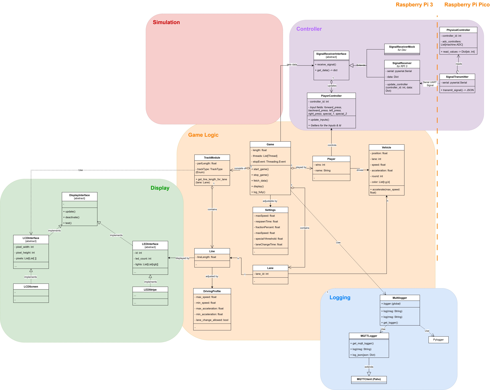

# LumenTrace

A high-performance MCU-based LED racing simulator. Bringing the classic slot car experience to the world of addressable LEDs with real-time physics and advanced light effects.

## Used Technologies

- Microcontrollers: Raspberry Pi Pico and Raspberry Pi 3 with an micro-SD card for data storage.
- Programming Languages: Arduino C++ for the microcontroller firmware, Python for OOP design, data processing, testing, simulation and visualization.
- Communication Protocols: High-Speed serial communication between Pico and Pi with UART, LED control via WS2812.
- Data Storage: Micro-SD card for storing and running the program on the Pi.

## Features

- Real-time physics simulation for accurate virtual slot car movement, including collision detection, acceleration/deceleration, falling down, recovery, and more.
- Advanced LED effects for immersive racing experience: Car headlights, rear lights, identification lights with warn indicators; track lighting for start/finish line; lap counter and more.
- Player controller with buttons for acceleration, braking, and lane switching, providing an interactive racing experience.
- High-speed communication between the microcontroller and the Raspberry Pi for seamless data exchange and control.
- Simulation with Python for debugging, testing, and visualization of the program logic and physics.
- Modular track design with interchangeable modules for different track layouts and configurations.
- Track modules with individual driving profiles to simulate different track conditions.
- Settings for customizing the racing experience.

## Game Mechanics

### Acceleration and Friction

- Controller input `forward_press` is mapped to vehicle acceleration each game tick.
- Friction is applied continuously and reduces current speed by a configurable percentage.
- Positive and negative movement are supported. If acceleration would invert speed direction in one step, speed is clamped to `0` first to keep transitions stable.

### Speed Update and Limits

- Speed is updated every tick as:
  - `speed += acceleration * acceleration_multiplier`
- Speed is clamped to `[-max_speed, +max_speed]`.
- This allows realistic throttle behavior while preventing unstable values at high update rates.

### Position and Round (Lap) Handling

- Position is updated from speed using the active game-tick interval.
- Each lane has its own total track length (sum of line lengths across modules).
- When position exceeds lane length, position wraps around and `round` is incremented.
- Reverse movement is also handled, including safe behavior for negative movement near lap boundaries.

### Lane Change (Timed Multi-Hop)

- Lane changes are triggered by `special_1` using a configurable threshold (`special_1_threshold`).
- The lane change is only allowed if the `driving_profile` of the current line has `lane_change_allowed = True`.
- A lane change is executed as one or more timed adjacent hops:
  - Example rightward: `1 -> 2 -> 3 -> 4` (lane order is determined by the sorted list in `game.lanes` from left (first) to right (last))
  - Example leftward: `1 <- 2 <- 3 <- 4`
- Each hop takes a fixed configurable tick count (`lane_change_ticks`), during which the vehicle is in a transition state.

### Position Conversion During Lane Change

- On each hop, the vehicle keeps its relative progress within the current track module.
- Conversion is proportional:
  - progress = `source_position / source_line_length`
  - target_position = `progress * target_line_length`
- This keeps cars visually and physically aligned when lane geometries have different lengths.

### Falling, Collision, and Respawn

- A vehicle falls immediately when its current speed or acceleration violates the driving profile of the active line:
  - `speed` must remain within `[min_speed, max_speed]`
  - `acceleration` must remain within `[min_acceleration, max_acceleration]`
- A vehicle also falls when it moves into a lane gap, meaning the current lane has no valid continuation in the next/previous module for the movement direction.
- Collision detection is evaluated for vehicles on the same lane.
  - If two vehicles are within collision distance, the vehicle in front falls.
  - The collision happens, if the position distance between the `settings.__vehicle_crash_distance` is violated.

### Respawn System

- Fallen vehicles become inactive and enter a respawn state (`settings.respawn_ticks`, `vehicle.respawn_ticks`, `vehicle.active`).
- While `vehicle.active` is `False`, vehicles are ignored in the race.
- After the `vehicle.respawn_ticks` count down to `0`, the vehicle attempts to respawn:
  - Try `position = 0` on any unoccupied lane that exists in the first track module. Unoccupied means no active vehicle is on the module. The vehicle speed and acceleration are reset to `0`.
  - If no lane is available, the vehicle remains inactive and tries again in the next tick.
- Respawn does not increment `vehicle.round`.

## Architecture

<!-- See file doc/architecture.png -->

The architecture is designed to be modular and extensible, with clear separation of concerns between different components:

- `Game` package handles the core game logic, including vehicle physics, track management, and players.
- `Simulation` package provides tools for testing and visualizing the game mechanics in Python.
- `Logger` package manages logging and debugging output for log files and MQTT.
- `Controller` package handles player input and translates it into game actions.
- `Display` package manages the LED effects and visual feedback for the game.

